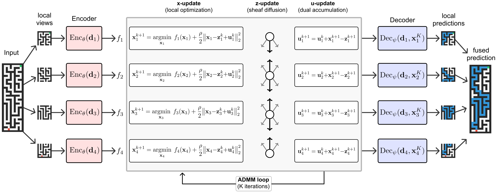

# Torch-Sheaf-ADMM

This repository is an **unofficial PyTorch port** for
students and educational projects, created with the help of **Codex (GPT-6)**.
Full credit for the
algorithm, paper, and original JAX implementation belongs to **Jeffrey Seely,
Bartłomiej Cupiał, and Llion Jones at Sakana AI**. See the
[original Sheaf-ADMM repository](https://github.com/SakanaAI/sheaf-admm) and
[paper](https://arxiv.org/abs/2605.31005). This port is independently
maintained and is not endorsed by the original authors.



*Figure from the original Sheaf-ADMM repository.*

[](https://arxiv.org/abs/2605.31005)
[](https://pub.sakana.ai/sheaf-admm/)

Sheaf-ADMM decomposes an input into overlapping local views, each processed by an
agent that solves a small convex subproblem parameterized by a neural encoder.
Agents coordinate through the Alternating Direction Method of Multipliers (ADMM),
with the inter-agent constraints specified by a *cellular sheaf* — which aspects
of neighboring solutions must agree. The optimization is unrolled for a fixed
number of iterations, so the whole pipeline is differentiable and every component
is trained end-to-end.

## Installation

This repository is intended to be run from a source checkout. Install
[uv](https://docs.astral.sh/uv/getting-started/installation/), then run:

```bash
uv sync
```

On Linux, the lockfile selects the PyTorch CUDA 13.0 wheel; training uses CUDA
when a compatible NVIDIA GPU is available and otherwise runs on CPU. JAX, Flax,
and Optax are available only for reference validation with `uv sync --extra reference`.
When switching an existing `.venv` from the old JAX CUDA 12 setup, use
`uv sync --locked --reinstall` once to restore CUDA libraries shared by the wheels.

## Data

```bash
uv run python -m sheaf_admm.data.build_maze \
  --height 19 \
  --width 19 \
  --train-size 10000 \
  --test-size 1000 \
  --min-path-length 18 \
  --ood-sizes \
  --output-dir datasets/maze_std3_19px_10k

uv run python -m sheaf_admm.data.build_mnist \
  --output-dir datasets/mnist

uv run python -m sheaf_admm.data.build_sudoku \
  --output-dir datasets/sudoku_easy
```

The MNIST and Sudoku builders download their source datasets on first run.

## Training

Each task has a Sheaf-ADMM model and a recurrent-MPNN baseline:

```bash
# Maze
uv run python scripts/train.py +experiment=maze_sheaf
uv run python scripts/train.py +experiment=maze_mpnn

# MNIST
uv run python scripts/train.py +experiment=mnist_sheaf
uv run python scripts/train.py +experiment=mnist_mpnn

# Sudoku
uv run python scripts/train.py +experiment=sudoku_sheaf
uv run python scripts/train.py +experiment=sudoku_sheaf_lora
uv run python scripts/train.py +experiment=sudoku_mpnn
```

Set `training.seed=42`, `123`, or `456` for the paper seeds. Set
`wandb.mode=online` to enable Weights & Biases logging. Checkpoints and
`history.json` are written to Hydra's run directory under `outputs/`.
The checkpoint is `checkpoint.pt` and contains model and EMA state dictionaries,
optimizer state, step, and the resolved config.

For the legacy Maze Sheaf `checkpoint.pkl` files produced by the JAX version,
install the reference extra and convert each trusted file offline:

```bash
uv sync --extra reference
uv run --extra reference python scripts/convert_checkpoint.py \
  path/to/checkpoint.pkl path/to/checkpoint.pt
```

## Visualization

The visualization script expects a Sheaf-ADMM checkpoint:

```bash
uv run python -m scripts.visualize \
  --checkpoint outputs/<date>/<time>/checkpoint.pt \
  --out-dir /tmp/sheaf_admm_viz
```

## Checks

```bash
uv run python -m ruff check .
uv run python -m pytest -q
uv run python validation/check_reference.py --device cpu
uv run python validation/check_lora_reference.py --device cpu
uv run python validation/smoke_all_configs.py --device cpu
uv run python validation/check_cli_tasks.py
```

With an NVIDIA GPU, repeat the three device-selectable validation commands with
`--device cuda`.
Run `uv run python -m pytest -q tests/test_compile_parity.py` to compare one
compiled and eager parameter update for each model family on CUDA.
The frozen JAX reference fixtures are bundled, so these checks use Torch only.

## How this port differs from the original JAX code

The model and ADMM update rules follow the original implementation. This port
uses PyTorch modules, autograd, optimizers, and CUDA tensors in place of JAX,
Flax, and Optax. It keeps the seven shipped experiment configurations and their
Hydra options. The Python import path remains `sheaf_admm`, while the project
and installable distribution are named `torch-sheaf-admm`.
Repeated CUDA steps use `torch.compile` by default; set
`TORCH_COMPILE_DISABLE=1` to use eager execution.

New checkpoints use PyTorch `checkpoint.pt` state dictionaries. A conversion
script is provided for trusted legacy Maze Sheaf checkpoints, as described in
[Training](#training). Other legacy checkpoints need additional conversion work.

The checks above compare fixed JAX reference outputs with PyTorch on CPU and
CUDA, including model outputs, ADMM behavior, and LoRA restriction maps. They
also exercise all seven configurations. These checks establish parity for the
covered cases; separately initialized runs can differ because the frameworks
use different random number generators.

## Citation

If you use this port, please cite the original work:

```bibtex
@inproceedings{sheafadmm2026,
  title     = {Learning Multi-Agent Coordination via Sheaf-ADMM},
  author    = {Seely, Jeffrey and Cupia{\l}, Bart{\l}omiej and Jones, Llion},
  booktitle = {International Conference on Machine Learning (ICML)},
  year      = {2026},
}
```

## License

This port retains the original repository's Apache 2.0 license in
[LICENSE](LICENSE). The original authors and Sakana AI retain credit for their
work.
